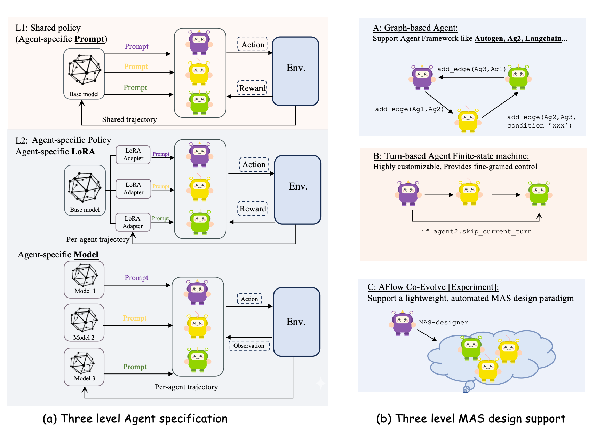

<div align="center">
  
  <h1>PETTINGLLMS</h1>
  <p>🚀 RL framework for training collaborative LLM agents with AT-GRPO.</p>
  <p>
    <a href="https://arxiv.org/pdf/2510.11062">📄 Paper</a> •
    <a href="https://pettingllms-ai.github.io/">🌐 Website</a> •
    <a href="https://www.youtube.com/watch?v=8WM-gVTrSBc">🎮 Demo</a> •
    <a href="https://pettingllms-docs.readthedocs.io/en/latest/">📖 Documentation</a> •
    <a href="https://pettingllms-docs.readthedocs.io/en/latest/About_us/">👥 About Us</a> •
    <a href="figs/wechat.jpg"> PettingLLMs</a>
  </p>
</div>

PettingLLMs is an open-source framework for on-policy reinforcement learning with multi-agent large language models. It implements AT-GRPO (Agent- and Turn-wise Group Relative Policy Optimization) to train collaborative LLM agents across diverse tasks.

## Highlights
- AT-GRPO algorithm for fine-grained agent and turn-wise credit assignment.
- Agent-specific policies via LoRA or fully independent models.
- Multi-level rewards: process, agent, and global/team signals.
- Multimodal examples (e.g., Qwen2.5VL) for vision + language tasks.
- Seamless switch between single-agent and multi-agent training flows.

## Feature Snapshot

| Capability | PettingLLMs | AgentLightning / VERL (typical) |
| --- | ---: | ---: |
| Agent-specific LoRA & models (per-agent adapters or different base models) | ✅ | ❌ (one shared model) |
| Multi-level rewards (process + agent + global/team) | ✅ | ❌ (mostly global only) |
| Fine-grained grouping (turn/phase/role/tool-call) | ✅ | ❌ (often one-task = one-group) |
| Multimodal (see Qwen2.5VL examples) | ✅ | ❌ |

<div align="center">
  
</div>

**Supported modes**
- ✅ Single-agent RL training
- ✅ Multi-agent RL training (one role-sharing policy)
- ✅ Multi-agent RL training (role-specialized policies using different LoRA adapters or different LLMs)

## 📰 News
- **[2025.12]** ✅ Roadmap milestone delivered: more environments (Verilog design, web search, robotics, database query, scientific discovery), multimodal support , and agentic framework integrations (AutoGen, LangGraph, LLamaIndex).
- **[2025.10]** 🚀 GitHub repository open-sourced and publicly available.
- **[2025.10]** 🎉 Paper released! Check out our [arXiv preprint](https://arxiv.org/pdf/2510.11062).
- **[2025.10]** 🔥 Support for different LoRA adapters per agent role—efficient role-specialized training.
- **[2025.09]** 🌍 Multi-environment support added: Game (Sudoku, Sokoban), Code (APPS, CodeContests), Math (AIME, OlympiadBench).
- **[2025.08]** 🤖 Multi-agent framework implementation: supports both shared single model and role-specific models.


## Agent Specification Levels

| Level | Specification Type | Architecture Components | Trajectory Flow | Description |
| :--- | :--- | :--- | :--- | :--- |
| **L1** | Shared Policy (agent-specific prompt) | 1 base model + distinct prompts | Shared trajectory | All agents share the same base model; roles are defined via different system prompts. |
| **L2** | Agent-specific Policy (agent-specific LoRA) | 1 base model + LoRA adapters | Per-agent trajectory | Agents share a base model but use lightweight, role-specific LoRA adapters for specialization. |
| **L3** | Agent-specific Model (full weights) | Independent models (Model 1, Model 2, Model 3...) | Per-agent trajectory | Each agent runs a separate model instance for maximal specialization. |

## MAS Design Options

| Category | Design Paradigm | Key Features & Support | Best For |
| :--- | :--- | :--- | :--- |
| **A** | Graph-based agent | Flexible topology; integrates with frameworks like AutoGen, Ag2, LangChain. | Complex, non-linear workflows needing external agent ecosystems. |
| **B** | Turn-based agent (finite-state machine) | Fine-grained control; customizable sequential execution. | Scenarios requiring precise operation order and state transitions. |
| **C** | AFlow Co-Evolve [experiment] | Automated design via a lightweight MAS-designer. | Experimental setups where the system self-optimizes agent structures. |

## 📦 Installation

```bash
git clone https://github.com/pettingllms-ai/PettingLLMs.git
cd PettingLLMs
bash setup.bash
```

## 🎯 Quick Start

### 1) Dataset preparation

```bash
# Code tasks (APPS, CodeContests, LiveCodeBench)
python scripts/dataprocess/load_code.py

# Math tasks (AIME24/25, OlympiadBench)
python scripts/dataprocess/load_math.py

# Game/Planning tasks (Sokoban, Sudoku)
python scripts/dataprocess/load_sokoban.py
```

Datasets are saved to `datasets/code/`, `datasets/math/`, and `datasets/sudoku_environments/`.

### 2) Training

Example: train a multi-agent system on math tasks.

```bash
bash scripts/train/math/math_L1_prompt.sh
```

Other training scripts live in `scripts/train/`:
- `code_single_policy.sh`, `code_two_policy.sh` (code)
- `plan_path_single.sh`, `plan_path_two_policy.sh` (planning)
- `sokoban_two_policy.sh`, `sokodu_single.sh` (games)

### 3) Evaluation

Edit `scripts/evaluate/evaluate.sh` to set your model path and config:

```bash
MODEL_PATHS=("/path/to/your/model")
CONFIG_NAME="math_single_policy"
```

Then run:

```bash
bash scripts/evaluate/evaluate.sh
```

## 📚 Citation

If you find PettingLLMs useful for your research or projects, please cite:

```bibtex
@article{zhao2025stronger,
  title={Stronger Together: On-Policy Reinforcement Learning for Collaborative LLMs},
  author={Zhao, Yujie and Hu, Lanxiang and Wang, Yang and Hou, Minmin and Zhang, Hao and Ding, Ke and Zhao, Jishen},
  journal={arXiv preprint arXiv:2510.11062},
  year={2025}
}
```

## 🔗 Acknowledgements

This work was primarily conducted by Yujie Zhao during her summer internship at **Intel Corporation**. We gratefully acknowledge Intel's support and resources.

- **VERL**: [VERL: Efficient RL Training for LLMs](https://github.com/volcengine/verl) — efficient distributed RL training infrastructure.
- **RLLM**: [RLLM: Reinforcement Learning with Language Models](https://github.com/rllm-org/rllm) — foundational RL algorithms for LLMs.

## 📌 License

Released under the MIT license. See `LICENSE` for details.
