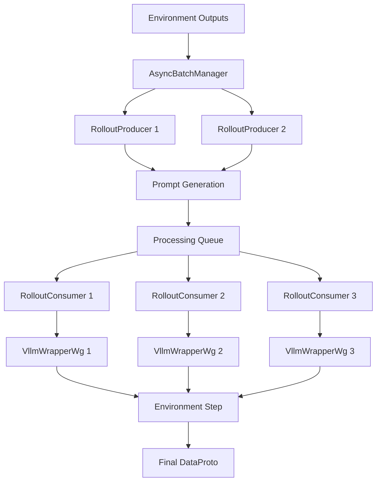

# Asynchronous Rollout Serving System

这是一个高性能的异步rollout生成系统，使用生产者-消费者模式来实现并发的LLM推理和环境交互。系统支持多个VllmWrapperWg实例并行生成rollouts。

## 系统架构



## 核心组件

### 1. AsyncBatchManager
- 管理异步批次处理的核心协调器
- 维护请求队列和批次状态
- 支持超时处理和错误恢复

### 2. RolloutProducer
- 生产者组件，负责从环境状态生成prompts
- 使用ContextManager将environment outputs转换为LLM inputs
- 支持多个producer并行工作

### 3. RolloutConsumer
- 消费者组件，执行两阶段处理：
  - Phase 1: LLM生成（使用VllmWrapperWg或ApiCallingWrapperWg）
  - Phase 2: 环境step操作
- 每个consumer拥有独立的LLM wrapper实例

### 4. RolloutServingManager
- 主要的服务管理器，协调所有组件
- 提供异步API接口
- 支持性能监控和健康检查

## 数据格式

系统生成的batch数据格式与agent_proxy的rollout函数返回的rollouts完全兼容：

```python
# DataProto结构
DataProto = TensorDict({
    "input_ids": torch.tensor([[101, 102, 103, ...], [201, 202, 203, ...]]),     # (batch_size, seq_len)
    "attention_mask": torch.tensor([[1, 1, 1, ...], [1, 1, 1, ...]]),           # (batch_size, seq_len)
    "position_ids": torch.tensor([[1, 2, 3, ...], [1, 2, 3, ...]]),             # (batch_size, seq_len)
    "responses": torch.tensor([[102, 103, ...], [202, 203, ...]]),               # (batch_size, seq_len-1)
    
    # 以下仅在 prepare_for_update=True 时存在
    "loss_mask": torch.tensor([[True, False, ...], [True, True, ...]]),         # (batch_size, seq_len-1)
    "rm_scores": torch.tensor([[0.5, 0.0, ...], [0.8, 0.3, ...]]),              # (batch_size, seq_len-1)
    "original_rm_scores": torch.tensor([[0.5, 0.0, ...], [0.8, 0.3, ...]]),     # (batch_size, seq_len-1)
}, batch_size=batch_size)

# 非张量批次数据
non_tensor_batch = {
    "env_ids": np.array([1, 2], dtype=object),
    "group_ids": np.array([0, 1], dtype=object),
    "messages_list": np.array([messages1, messages2], dtype=object)
}

# 元信息
meta_info = {
    "metrics": {
        "response_length": 15.5,
        "bandit/success_rate": 0.75,
        "bandit/non-zero/success_rate": 0.75
    }
}
```

## 使用方法

### 基本使用

```python
import asyncio
from ragen.llm_serving import RolloutServingManager

async def basic_usage(config):
    # 初始化服务管理器
    serving_manager = RolloutServingManager(
        config=config,
        num_producers=2,
        num_consumers=4,
        max_queue_size=100,
        batch_timeout=30.0
    )
    
    try:
        # 启动服务
        await serving_manager.initialize()
        await serving_manager.start()
        
        # 准备环境输出数据
        env_outputs = [
            {
                "env_id": 0,
                "history": [{"state": "initial state", "actions_left": 3}],
                "group_id": 0,
                "tag": "test_env",
                "metrics": {"test_env/success_rate": 0.5}
            }
        ]
        
        # 生成rollout batch
        result = await serving_manager.generate_rollout_batch(
            env_outputs, 
            mode="validation",
            timeout=30.0
        )
        
        print(f"Generated batch with shape: {result.batch['input_ids'].shape}")
        
    finally:
        await serving_manager.shutdown()
```

### 多轮对话rollout

```python
async def multi_turn_usage(config):
    serving_manager = RolloutServingManager(config=config)
    
    try:
        await serving_manager.initialize()
        await serving_manager.start()
        
        # 初始环境状态
        initial_env_outputs = [...]
        
        # 生成多轮rollout
        result = await serving_manager.generate_multi_turn_rollout(
            initial_env_outputs,
            mode="validation",
            max_turns=5,
            timeout_per_turn=15.0
        )
        
    finally:
        await serving_manager.shutdown()
```

### 并发批次处理

```python
async def concurrent_batches(config):
    serving_manager = RolloutServingManager(config=config)
    
    try:
        await serving_manager.initialize()
        await serving_manager.start()
        
        # 准备多个批次
        batch_requests = [env_outputs_1, env_outputs_2, env_outputs_3]
        
        # 并发处理所有批次
        tasks = [
            serving_manager.generate_rollout_batch(batch, mode="validation")
            for batch in batch_requests
        ]
        
        results = await asyncio.gather(*tasks)
        
    finally:
        await serving_manager.shutdown()
```

## 配置参数

### RolloutServingManager参数

- `num_producers`: 生产者工作进程数量（默认2）
- `num_consumers`: 消费者工作进程数量（默认4）
- `max_queue_size`: 最大队列大小（默认100）
- `batch_timeout`: 批次处理超时时间（默认30秒）

### 性能调优建议

1. **生产者数量**: 通常设置为1-2个，因为prompt生成相对较快
2. **消费者数量**: 根据GPU数量和LLM推理能力设置，建议每个GPU 1-2个consumer
3. **队列大小**: 根据内存容量和预期并发量设置
4. **超时时间**: 根据模型大小和推理时间调整

## 监控和调试

### 健康检查

```python
health = await serving_manager.health_check()
print(f"系统状态: {health['status']}")
print(f"处理批次总数: {health['total_batches_processed']}")
print(f"平均吞吐量: {health['avg_throughput']} batches/sec")
```

### 性能基准测试

```python
benchmark_results = await serving_manager.benchmark(
    num_test_batches=10,
    batch_size=4,
    mode="validation"
)
print(f"平均批次处理时间: {benchmark_results['avg_batch_time']:.2f}s")
print(f"吞吐量: {benchmark_results['throughput_batches_per_sec']:.2f} batches/sec")
```

### 队列状态监控

```python
queue_stats = serving_manager.get_queue_status()
print(f"待处理队列: {queue_stats['pending_queue_size']}")
print(f"处理中队列: {queue_stats['processing_queue_size']}")
print(f"活跃批次: {queue_stats['active_batches']}")
```

## 错误处理

系统提供多层级的错误处理：

1. **批次级错误**: 单个批次失败不影响其他批次
2. **工作进程错误**: 单个producer/consumer失败会自动重试
3. **超时处理**: 支持配置批次处理超时
4. **优雅关闭**: 支持等待正在处理的批次完成后关闭

## 运行示例

```bash
# 运行基本示例
python -m ragen.llm_serving.example_usage --config-name=base

# 运行serving manager测试
python -m ragen.llm_serving.rollout_serving --config-name=base
```

## 与现有系统集成

这个异步serving系统完全兼容现有的agent_proxy接口：

```python
# 现有的同步方式
rollouts = proxy.rollout(dataproto, val=True)

# 新的异步方式
rollouts = await serving_manager.generate_rollout_batch(env_outputs, mode="validation")

# 数据格式完全一致
assert rollouts.batch.keys() == expected_keys
assert rollouts.non_tensor_batch.keys() == expected_non_tensor_keys
```

## 注意事项

1. 系统需要在async context中运行
2. 确保在shutdown前调用serving_manager.shutdown()
3. 监控内存使用，特别是在高并发场景下
4. 根据硬件配置调整producer/consumer数量
5. 定期检查系统健康状态和性能指标 